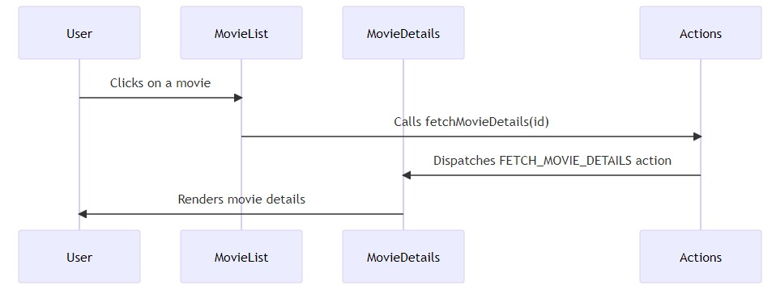

# Movie List Project

This project is a simple MERN stack application that displays a list of movies and their details.

## Project Structure

The project is divided into two main parts:

1. *Server*: This is the backend of the application. It's responsible for fetching data from the API and serving it to the client.

2. *Client*: This is the frontend of the application. It's responsible for displaying the data fetched from the server.

Here is a simple diagram that shows how the client and server interact:


## In a new terminal window, navigate to the backend directory and start the server
```
cd backend
npm run dev   or  npm start
```

## In a new terminal window, navigate to the client directory and start the client
```
cd frontend
npm start
```


 ## The flowchart to understand the flow of data:
